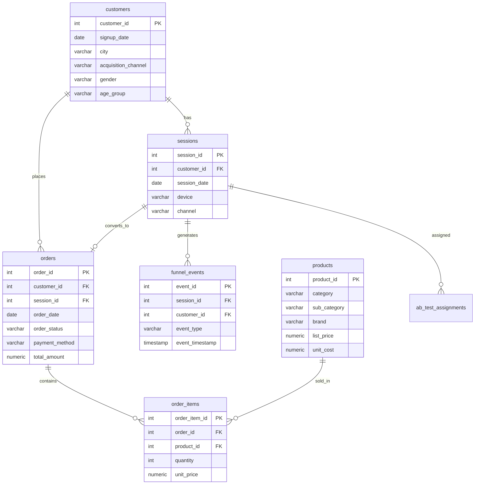

# UrbanThread — E-commerce Funnel & Customer Retention Analytics

End-to-end analytics project on a fashion e-commerce platform: a PostgreSQL
data warehouse, SQL-based funnel/cohort/RFM/A-B-test analysis, an Excel
executive dashboard, and a Power BI model — built to practice the full
analyst workflow from raw event data to a decision-ready dashboard.

> **Note on data:** UrbanThread is a fictional brand. All data (customers,
> sessions, orders) is synthetically generated (`scripts/generate_data.py`,
> seeded for reproducibility) to resemble real fashion e-commerce behavior —
> funnel drop-off shapes, channel mix, retention decay — without using any
> real company's data.

---

## Why this project

Most "portfolio SQL projects" stop at writing a few SELECT queries against a
static CSV. This one is built the way an analyst would actually work it:
generate/receive raw event-level data → land it in a proper relational
schema → write production-style SQL (CTEs, window functions, NTILE
segmentation) → turn query output into a dashboard a stakeholder can actually
read → run and interpret an A/B test with a real significance test, not just
"B looks bigger."

## Business questions answered

1. Where in the browse → purchase funnel are we losing the most users, and
   does that differ by channel or device?
2. How well do we retain customers month-over-month after signup, and which
   RFM segments are worth targeting?
3. Did the new checkout page (A/B test) actually improve conversion, or is
   the improvement within noise?
4. Which marketing channels are efficient (CAC, ROAS) vs. burning budget?
5. Which product categories drive revenue vs. margin vs. returns?

## Tech stack

| Layer | Tool |
|---|---|
| Data generation | Python (synthetic, seeded, ~172K funnel events across 9K customers) |
| Database | PostgreSQL 16 |
| Analysis | SQL — CTEs, window functions (`NTILE`, moving averages), `\copy` bulk load |
| Statistics | Python (two-proportion z-test for the A/B test) |
| Dashboard 1 | Excel (openpyxl) — executive summary + 5 supporting tabs, chart-driven |
| Dashboard 2 | Power BI — relational model + DAX measures (see `powerbi/POWERBI_SETUP_GUIDE.md`) |

## Repo structure

```
├── data/                    Raw synthetic CSVs (customers, sessions, funnel_events, orders...)
├── sql/
│   ├── 00_load_data.sql          \copy statements to bulk-load data/*.csv
│   ├── 01_schema.sql            Table DDL + indexes
│   ├── 02_funnel_analysis.sql   Funnel conversion, by channel, by device, monthly trend
│   ├── 03_cohort_retention.sql  Signup-cohort retention matrix + RFM segmentation
│   └── 04_ab_test_and_marketing.sql   Checkout A/B test, marketing ROI, category performance
├── scripts/
│   ├── generate_data.py         Synthetic data generator (seeded, reproducible)
│   ├── ab_test_stats.py         Two-proportion z-test on the checkout A/B test
│   ├── export_query_results.py  Runs the SQL and exports results to CSV
│   └── build_excel_dashboard.py Builds the Excel dashboard from query output
├── excel/
│   └── Ecommerce_Funnel_Retention_Dashboard.xlsx
├── powerbi/
│   ├── exports/              Pre-aggregated CSVs (funnel, cohort matrix, RFM, A/B, ROI)
│   ├── raw_tables/           Flat CSVs for a from-scratch Power BI model
│   └── POWERBI_SETUP_GUIDE.md
├── docs/
│   └── erd.md                 Entity-relationship diagram
├── requirements.txt
└── README.md
```

## How to reproduce

```bash
# 1. Generate the synthetic dataset
cd scripts
python3 generate_data.py                 # writes CSVs into ../data/

# 2. Load into PostgreSQL (run from the repo root so the relative paths in
#    00_load_data.sql resolve)
cd ..
createdb ecommerce_analytics
psql -d ecommerce_analytics -f sql/01_schema.sql
psql -d ecommerce_analytics -f sql/00_load_data.sql
cd scripts

# 3. Run the analysis
psql -d ecommerce_analytics -f ../sql/02_funnel_analysis.sql
psql -d ecommerce_analytics -f ../sql/03_cohort_retention.sql
psql -d ecommerce_analytics -f ../sql/04_ab_test_and_marketing.sql

# 4. Stats + dashboard
python3 ab_test_stats.py
python3 export_query_results.py
python3 build_excel_dashboard.py
```

## Data model



## Key findings

- **Mobile is the biggest funnel leak.** Mobile carries 68% of sessions but
  converts at 6.3%, vs. 16.5% on Desktop — over 2.5x lower — pointing to a
  mobile checkout UX problem rather than a traffic-quality problem.
- **Paid acquisition is underperforming owned channels.** Direct and Email
  convert at 16.7% and 14.0% respectively; Paid Social and Affiliate trail at
  4.1% and 3.5%, and post the weakest ROAS (0.39x and 0.44x) — spend here is
  not paying for itself on a last-click basis.
- **The checkout redesign works.** Variant B (redesigned checkout) lifted
  completion from 9.05% to 10.32% — a statistically significant +14%
  relative lift (two-proportion z-test, z = 2.11, p = 0.035).
- **Retention drops sharply after month 1–2** across every signup cohort,
  then flattens — a pattern that lines up with the "At Risk" RFM segment
  (customers with strong past spend who've gone quiet) representing the
  single highest-value re-engagement target at ~₹81L in historical revenue.
- **Footwear is the strongest category** on both revenue and margin;
  Beauty has the highest unit volume but the lowest average order value.

## Limitations & next steps

- Data is synthetic — behavioral patterns are modeled (channel/device
  quality multipliers, retention decay) rather than empirically observed, so
  treat the specific percentages as illustrative, not a real business's
  numbers.
- The A/B test uses a single two-proportion z-test; a production rollout
  would also check for novelty effects (does the lift hold beyond week 1?)
  and segment the result by device before shipping.
- Next iteration: incremental/dbt-style transformations instead of one-shot
  SQL scripts, and a scheduled refresh into Power BI service instead of a
  static CSV export.

---
*Built by Anshikha Chaurasiya as a self-directed analytics project.*
