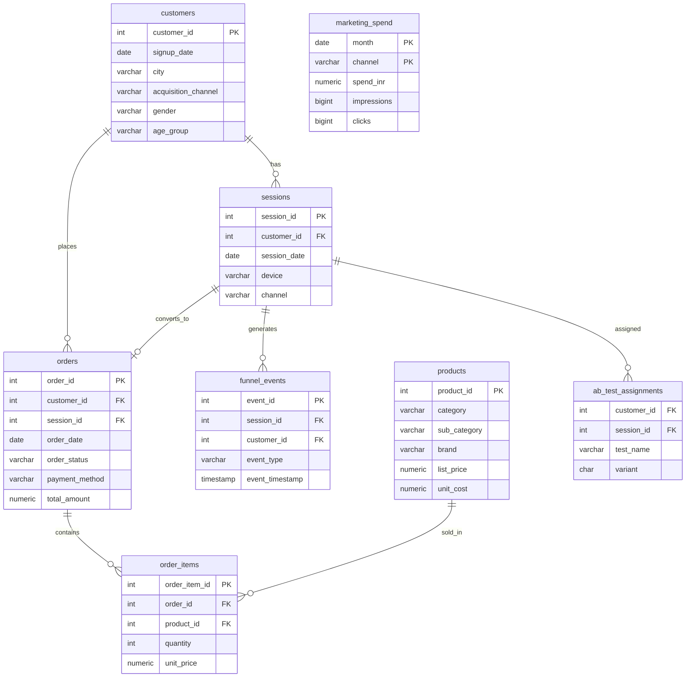

# Entity-Relationship Diagram

`funnel_events.event_type` is a state machine: `home_view → product_view →
add_to_cart → checkout_start → purchase`. A session can stop at any stage;
only sessions that reach `purchase` have a matching row in `orders`.
